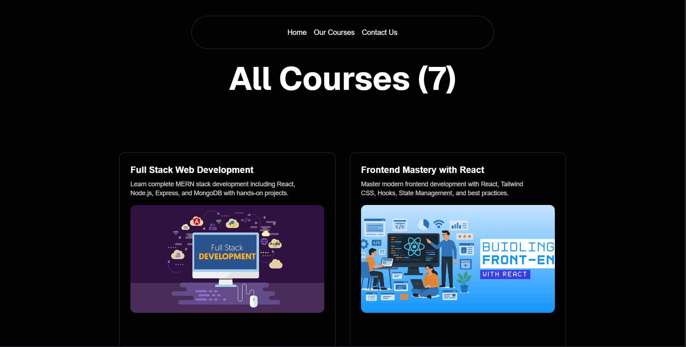

# Coding Classes


[](https://nextjs.org/)
[](https://www.typescriptlang.org/)
[](https://tailwindcss.com/)
[](#)

> A simple, responsive learning platform — my first Next.js project built while learning Next.js, TypeScript, and Aceternity UI.

---

## ✨ Features
- Home, Courses, and Contact pages  
- Responsive layout with Tailwind CSS  
- UI components powered by Aceternity UI  
- TypeScript for type safety  
- Simple, clean UI ideal for learning and demos

---

## 🚀 Quick start

```bash
# clone
git clone https://github.com/<your-username>/<your-repo>.git
cd <your-repo>

# install
npm install
# or
# pnpm install
# yarn

# dev
npm run dev
# open http://localhost:3000

🧭 Project structure
/app                # Next.js app routes (or /pages if using pages router)
  /courses
  /contact
  /design
  /devops
  /web-dev
/components         # Reusable UI components
/public             # Static assets (banner.png, demo.gif)
/styles             # Global styles / Tailwind config


🛠️ Environment & build

If you add env vars later, create .env.local and add keys. For production build:

npm run build
npm run start
# or deploy to Vercel directly

✅ Tests & linting

Add scripts if you use them, e.g.:

"scripts": {
  "dev": "next dev",
  "build": "next build",
  "start": "next start",
  "lint": "next lint"
}

🤝 Contributing

This is my learning project — contributions and feedback are welcome.
If you want to contribute:

Fork the repo

Create a branch feat/your-change

Open a PR with a short description

📸 Screenshots

Add screenshots to /public/screenshots/ and reference them:
```




📜 License

MIT © Manish Kumar Yadav. See LICENSE for details.